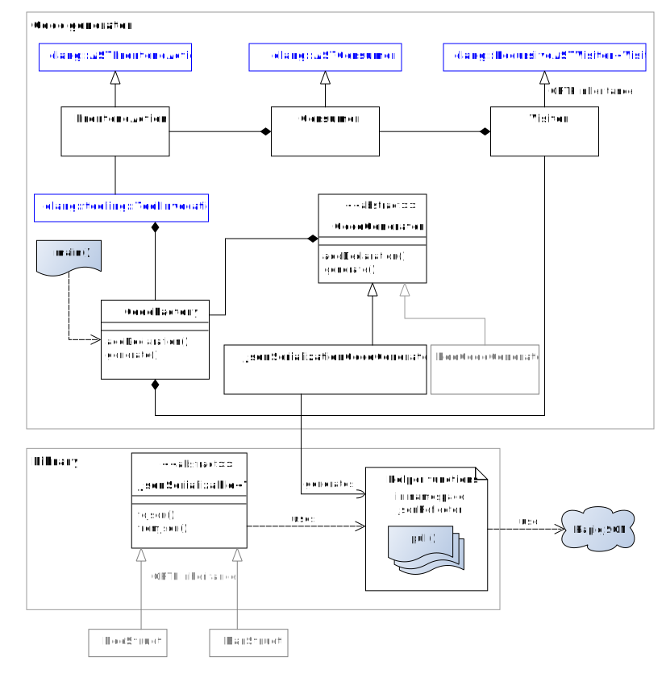

# Reflective RapidJSON

The main goal of this project is to provide a code generator for serializing/deserializing C++ objects to/from JSON
using Clang and RapidJSON.

Extending the generator to generate code for other formats or other applications of reflection is possible as well.
A serializer/deserializer for a platform independent binary format has already been implemented.

It would also be possible to extend the library/generator to provide generic reflection (not implemented yet).

The following documentation focuses on the JSON (de)serializer. However, most of it is also true for the mentioned
binary (de)serializer which works quite similar.

## Open for other reflection approaches
The reflection implementation used behind the scenes of this library is exchangeable:

* This repository already provides a small, additional header to use RapidJSON with Boost.Hana. This allows to
  serialize or dezerialize simple data structures declared using the `BOOST_HANA_DEFINE_STRUCT` macro rather than
  requiring the code generator.
* When native reflection becomes standardized, it would be possible to make use of it as well. In this case,
  the code generator could still act as a fallback.

## Current state
The basic functionality is implemented, tested and documented:

* Serialization and deserialization of datatypes listed under "Supported datatypes"
    * Nesting and inheritance is possible
    * Adapting 3rdparty structs/classes is supported
* Basic error handling when deserializing
* CMake macro to conveniently include the code generator into the build process
* Allow to use Boost.Hana

### Planned features and TODOs
There are still things missing which would likely be very useful in practise. The following list contains the
open TODOs which are supposed to be most relevant in practise:

* [ ] Allow to specify which member variables should be considered
    * This could work similar to Qt's Signals & Slots macros.
    * But there should also be a way to do this for 3rdparty types.
    * Note that currently all public, non-static member variables are (de)serialized.
* [ ] Support getter/setter methods
    * [ ] Allow to serialize the result of methods
    * [ ] Allow to pass a deserialized value to a method
* [ ] Validate enum values when deserializing
* [ ] Untie serialization and deserialization

For a full list of further ideas, see [TODOs.md](./TODOs.md).

## Supported datatypes
The following table shows the mapping of supported C++ types to supported JSON types:

| C++ type                                                      | JSON type    |
| ------------------------------------------------------------- |:------------:|
| custom structures/classes                                     | object       |
| `bool`                                                        | true/false   |
| signed and unsigned integral types                            | number       |
| `float` and `double`                                          | number       |
| `enum` and `enum class`                                       | number       |
| `std::string`                                                 | string       |
| `const char *`                                                | string       |
| iteratable lists (`std::vector`, `std::list`, ...)            | array        |
| sets (`std::set`, `std::unordered_set`, `std::multiset`, ...) | array        |
| `std::tuple`                                                  | array        |
| `std::unique_ptr`, `std::shared_ptr`                          | depends/null |
| `std::map`, `std::unordered_map`                              | object       |
| `JsonSerializable`                                            | object       |

### Remarks
* Raw pointer are not supported. This prevents
  forgetting to free memory which would have to be allocated when deserializing.
* For the same reason `const char *` strings are only supported for serialization.
* Enums are (de)serialized as their underlying integer value. When deserializing, it is currently *not* checked
  whether the present integer value is a valid enumeration item.
* The JSON type for smart pointer depends on the type the pointer refers to. It can also be `null`.
* If multiple `std::shared_ptr` instance might point to the same object this object is serialized multiple times.
  When deserializing those identical objects, it is currently not possible to share the memory (again). So each
  `std::shared_ptr` will point to its own copy. Note that this limitation is *not* true when using binary
  serialization.
* For deserialization
    * iteratables must provide an `emplace_back` method. So deserialization of eg. `std::forward_list`
      is currently not supported.
    * custom types must provide a default constructor.
    * constant member variables are skipped.
* For custom (de)serialization, see the section below.
* The binary (de)serializer supports approximately the same C++ types but obviously maps them to a platform
  independent binary representation rather than a JSON type.

## Usage
This example shows how the library can be used to make a `struct` serializable:
<pre>
#include &lt;reflective_rapidjson/json/serializable.h&gt;

// define structures, eg.
struct TestObject : public ReflectiveRapidJSON::JsonSerializable&lt;TestObject&gt; {
    int number;
    double number2;
    vector&lt;int&gt; numbers;
    string text;
    bool boolean;
};
struct NestingObject : public ReflectiveRapidJSON::JsonSerializable&lt;NestingObject&gt; {
    string name;
    TestObject testObj;
};
struct NestingArray : public ReflectiveRapidJSON::JsonSerializable&lt;NestingArray&gt; {
    string name;
    vector&lt;TestObject&gt; testObjects;
};

// serialize to JSON
NestingArray obj{ ... };
cout &lt;&lt; "JSON: " &lt;&lt; obj.toJson().GetString();

// deserialize from JSON
const auto obj = NestingArray::fromJson(...);

// in exactly one of the project's translation units
#include "reflection/code-defining-structs.h"
</pre>

Note that the header included at the bottom must be generated by invoking the code generator appropriately, eg.:
<pre>
reflective_rapidjson_generator \
    --input-file "$srcdir/code-defining-structs.cpp" \
    --output-file "$builddir/reflection/code-defining-structs.h"
</pre>

There are further arguments available, see:
<pre>
reflective_rapidjson_generator --help
</pre>

#### Binary (de)serialization
It works very similar to the example above. Just use the `BinarySerializable` class instead (or in addition):

<pre>
#include &lt;reflective_rapidjson/binary/serializable.h&gt;
struct TestObject : public ReflectiveRapidJSON::BinarySerializable&lt;TestObject&gt;
</pre>

#### Invoking code generator with CMake macro
It is possible to use the provided CMake macro to automate the code generator invocation:
<pre>
# find the package and make macro available
find_package(reflective-rapidjson REQUIRED)
list(APPEND CMAKE_MODULE_PATH ${REFLECTIVE_RAPIDJSON_MODULE_DIRS})
include(ReflectionGenerator)

# "link" against reflective_rapidjson
# it is a header-only lib so this will only add the required include paths
# to your target
target_link_libraries(mytarget PRIVATE reflective_rapidjson)

# invoke macro
add_reflection_generator_invocation(
    INPUT_FILES code-defining-structs.cpp
    GENERATORS json
    OUTPUT_LISTS LIST_OF_GENERATED_HEADERS
    CLANG_OPTIONS_FROM_TARGETS mytarget
)
</pre>

This will produce the file `code-defining-structs.h` in the directory `reflection` in the current build directory. So
make sure the current build directory is added to the include directories of your target. The default output directory can
also be overridden by passing `OUTPUT_DIRECTORY custom/directory` to the arguments.

It is possible to specify multiple input files at once. A separate output file is generated for each input. The output files
will always have the extension `.h`, independently of the extension of the input file.

The full paths of the generated files are also appended to the variable `LIST_OF_GENERATED_HEADERS` which then can be added
to the sources of your target. Of course this can be skipped if not required/wanted.

The macro will also automatically pass Clang's resource directory which is detected by invoking `clang -print-resource-dir`.
To adjust that, just set the cache variable `REFLECTION_GENERATOR_CLANG_RESOURCE_DIR` before including the module.

For an explanation of the `CLANG_OPTIONS_FROM_TARGETS` argument, read the next section.

#### Passing Clang options
It is possible to pass additional options to the Clang tool invocation used by the code generator.
This can be done using the `--clang-opt` argument or the `CLANG_OPTIONS` argument when using the CMake macro.

For example, additional definitions could be added using `--clang-opt -DSOME_DEFINE -DANOTHER_DEFINE`.
But it is actually possible to pass anything from `clang --help`, including the `-X...` options.

##### Specifying Clang's resource directory
In case you get a massive number of errors, ensure Clang's resource directory can be located.
[Clang documentation](https://clang.llvm.org/docs/LibTooling.html#libtooling-builtin-includes):

> The default location to look for builtin headers is in a path `$(dirname /path/to/tool)/../lib/clang/3.3/include` relative to the tool binary.

To adjust the default location, just add eg. `--clang-opt -resource-dir /usr/lib/clang/5.0.1` to the arguments.

##### Pass options from regular targets
It makes most sense to specify the same options for the code generator as during the actual compilation. This way the code
generator uses the same flags, defines and include directories as the compiler and hence behaves like the compiler.  
When using the CMake macro, it is possible to automatically pass all compile flags, compile definitions and include directories
from certain targets to the code generator. Those targets can be specified using the
Macro's `CLANG_OPTIONS_FROM_TARGETS` argument.

#### Notes regarding cross-compilation
* For cross compilation, it is required to build the code generator for the platform you're building on.
* Since the code generator is likely not required under the target platform, you should add `-DNO_GENERATOR:BOOL=ON` to the CMake
  arguments when building Reflective RapidJSON for the target platform.
* When using the `add_reflection_generator_invocation` macro, you need to set the following CMake cache variables:
    * `REFLECTION_GENERATOR_EXECUTABLE:FILEPATH=/path/to/reflective_rapidjson_generator`
        * specifies the path of the code generator executable built for the platform you're building on
        * only required if the executable is not in the path anyways
    * `REFLECTION_GENERATOR_TRIPLE:STRING=machine-vendor-operatingsystem`
        * specifies the GNU platform triple for the target platform
        * examples for cross compiling with mingw-w64 under GNU/Linux:  
          `x86_64-w64-mingw32`, `i686-w64-mingw32`
    * `REFLECTION_GENERATOR_INCLUDE_DIRECTORIES:STRING=/custom/prefix/include`
        * implicit include directories for target platform
        * example for cross compiling with mingw-w64 under GNU/Linux:  
          `/usr/lib/gcc/x86_64-w64-mingw32/7.2.1/include;/usr/x86_64-w64-mingw32/include/c++/7.2.1/x86_64-w64-mingw32;/usr/x86_64-w64-mingw32/include`
* The Arch Linux packages mentioned at the end of the README file also include `mingw-w64` variants which give a concrete example how
  cross-compilation can be done.

### Using Boost.Hana instead of the code generator
The same example as above. However, this time Boost.Hana is used - so it doesn't require invoking the generator.

<pre>
#include "&lt;reflective_rapidjson/json/serializable-boosthana.h&gt;

// define structures using BOOST_HANA_DEFINE_STRUCT, eg.
struct TestObject : public JsonSerializable&lt;TestObject&gt; {
    BOOST_HANA_DEFINE_STRUCT(TestObject,
        (int, number),
        (double, number2),
        (vector&lt;int&gt;, numbers),
        (string, text),
        (bool, boolean)
    );
};
struct NestingObject : public JsonSerializable&lt;NestingObject&gt; {
    BOOST_HANA_DEFINE_STRUCT(NestingObject,
        (string, name),
        (TestObject, testObj)
    );
};
struct NestingArray : public JsonSerializable&lt;NestingArray&gt; {
    BOOST_HANA_DEFINE_STRUCT(NestingArray,
        (string, name),
        (vector&lt;TestObject&gt;, testObjects)
    );
};

// serialize to JSON
NestingArray obj{ ... };
cout &lt;&lt; "JSON: " &lt;&lt; obj.toJson().GetString();

// deserialize from JSON
const auto obj = NestingArray::fromJson(...);
</pre>

So beside the `BOOST_HANA_DEFINE_STRUCT` macro, the usage remains the same.

#### Disadvantages
* Use of ugly macro required
* No context information for errors like type-mismatch available
* Inherited members not considered
* Proper support for enums is unlikely

### Enable reflection for 3rd party classes/structs
It is obvious that the previously shown examples do not work for classes
defined in 3rd party header files as it requires adding an additional
base class.

To work around this issue, one can use the `REFLECTIVE_RAPIDJSON_MAKE_JSON_SERIALIZABLE`
macro. It will enable the `toJson` and `fromJson` methods for the specified class
in the `ReflectiveRapidJSON::JsonReflector` namespace:

<pre>
// somewhere in included header
struct ThridPartyStruct
{ ... };

// somewhere in own header or source file
REFLECTIVE_RAPIDJSON_MAKE_JSON_SERIALIZABLE(ThridPartyStruct)

// (de)serialization
ReflectiveRapidJSON::JsonReflector::toJson(...).GetString();
ReflectiveRapidJSON::JsonReflector::fromJson&lt;ThridPartyStruct&gt;("...");
</pre>

The code generator will emit the code in the same way as if `JsonSerializable` was
used.

By the way, the functions in the `ReflectiveRapidJSON::JsonReflector` namespace can also
be used when inheriting from `JsonSerializable` (instead of the member functions).

### (De)serializing private members
By default, private members are not considered for (de)serialization. However, it is possible
to enable this by adding `friend` methods for the helper functions of Reflective RapidJSON.

To make things easier, there's a macro provided:
<pre>
struct SomeStruct : public JsonSerializable&lt;SomeStruct&gt; {
    REFLECTIVE_RAPIDJSON_ENABLE_PRIVATE_MEMBERS(SomeStruct);

public:
    std::string publicMember = "will be (de)serialized anyways";

private:
    std::string privateMember = "will be (de)serialized with the help of REFLECTIVE_RAPIDJSON_ENABLE_PRIVATE_MEMBERS macro";
};
</pre>

#### Caveats
* It will obviously not work for 3rd party structs.
* This way to allow (de)serialization of private members must be applied when using Boost.Hana
  and there are any private members present. The reason is that accessing the private members can
  currently not prevented when using Boost.Hana.

### Custom (de)serialization
Sometimes it is appropriate to implement custom (de)serialization. For instance, a
custom object representing a time value should likey be serialized as a string rather
than an object containing the internal structure.

An example for such custom (de)serialization can be found in the file
`json/reflector-chronoutilities.h`. It provides (de)serialization of `DateTime` and
`TimeSpan` objects from the C++ utilities library mentioned under dependencies.

### Remarks
* Static member variables and member functions are currently ignored by the generator.
* It is currently not possible to ignore a specific member variable.

### Further examples
* Checkout the test cases for further examples. Relevant files are in
  the directories `lib/tests` and `generator/tests`.
* There's also my
  [tag editor](https://github.com/Martchus/tageditor), which uses Reflective RapidJSON to provide
  a JSON export.
  See [json.h](https://github.com/Martchus/tageditor/blob/master/cli/json.h) and
  [mainfeatures.cpp#exportToJson](https://github.com/Martchus/tageditor/blob/master/cli/mainfeatures.cpp#L856).

## Architecture
The following diagram gives an overview about the architecture of the code generator and wrapper library
around RapidJSON:

* blue: classes from LibTooling/Clang
* grey: conceivable extension or use

## Install instructions

### Dependencies
The following dependencies are required at build time. Note that Reflective RapidJSON itself
and *none* of these dependencies are required at runtime by an application which makes use of
Reflective RapidJSON.

* C++ compiler and C++ standard library supporting at least C++14
* the [CMake](https://cmake.org) build system
* LibTooling from [Clang](https://clang.llvm.org) for the code generator (optional when using
  Boost.Hana)
* [RapidJSON](https://github.com/Tencent/rapidjson) for JSON (de)serialization
* [C++ utilities](https://github.com/Martchus/cpp-utilities) for various helper functions

#### Optional
* [Boost.Hana](http://www.boost.org/doc/libs/1_65_1/libs/hana/doc/html/index.html) for using
  `BOOST_HANA_DEFINE_STRUCT` instead of code generator
* [CppUnit](https://www.freedesktop.org/wiki/Software/cppunit) for building and running the tests
* [Doxygen](http://www.doxygen.org) for generating API documentation
* [Graphviz](http://www.graphviz.org) for diagrams in the API documentation

#### Remarks
* It is not required to use CMake as build system for your own project. However, when using a
  different build system, there is no helper for adding the code generator to the build process
  provided (so far).
* I usually develop using the latest version of those dependencies. So it is recommend to get the
  the latest versions as well. I tested the following versions so far:
    * GCC 7.2.1/7.3.0/8.1.0 or Clang 5.0/6.0/7.0 as compiler
    * libstdc++ from GCC 7.2.1/7.3.0/8.1.0
    * CMake 3.10.1
    * Clang 5.0.0/5.0.1 for LibTooling
    * RapidJSON 1.1.0
    * C++ utilities 4.12
    * Boost.Hana 1.65.1, 1.66.0, 1.67.0, 1.68.0
    * CppUnit 1.14.0
    * Doxygen 1.8.13
    * Graphviz 2.40.1
* The binary (de)serializer requires C++ utilities at runtime. So when using it, it is required to
  link against C++ utilities.

### How to build
#### 1. Install dependencies
Install all required dependencies. Under a typical GNU/Linux system most of these dependencies
can be installed via the package manager. Otherwise follow the links in the "Dependencies" section
above.

C++ utilities is likely not available as package. However, it is possible to build C++ utilities
together with `reflective-rapidjson` to simplify the build process. The following build script makes
use of this. (To use system C++ utilities, just skip any lines with "`c++utilities`" in the following
examples.)

#### 2. Make dependencies available

When installing (some) of the dependencies at custom locations, it is likely neccassary to tell
CMake where to find them. If you installed everything using packages provided by the system,
you can skip this step of course.

To specify custom locations, just set some environment variables before invoking CMake. This
can likely be done in your IDE settings and of course at command line. Here is a Bash example:
<pre>
export PATH=$CUSTOM_INSTALL_PREFIX/bin:$PATH
export CMAKE_PREFIX_PATH=$CUSTOM_INSTALL_PREFIX:$CMAKE_PREFIX_PATH
export CMAKE_LIBRARY_PATH=$CUSTOM_INSTALL_PREFIX/lib:$CMAKE_LIBRARY_PATH
export CMAKE_INCLUDE_PATH=$CUSTOM_INSTALL_PREFIX/include:$CMAKE_INCLUDE_PATH
</pre>

There are also a lot of [useful variables](https://cmake.org/Wiki/CMake_Useful_Variables)
that can be specified as CMake arguments. It is also possible to create a
[toolchain file](https://cmake.org/cmake/help/v3.10/manual/cmake-toolchains.7.html).

#### 3. Get sources, eg. using Git:
<pre>
cd $SOURCES
git clone https://github.com/Martchus/cpp-utilities.git c++utilities
git clone https://github.com/Martchus/reflective-rapidjson.git
</pre>

If you don't want to build the development version, just checkout the desired version tag.

#### 4. Run the build script
Here is an example for building with GNU Make:
<pre>
cd $BUILD_DIR
# generate Makefile
cmake \
 -DCMAKE_BUILD_TYPE:STRING=Release \
 -DCMAKE_INSTALL_PREFIX:PATH="/final/install/prefix" \
 -DBUNDLED_CPP_UTILITIES_PATH:PATH="$SOURCES/c++utilities" \
 "$SOURCES/reflective-rapidjson"
# build library and generators
make
# build and run tests (optional, requires CppUnit)
make check
# build tests but do not run them (optional, requires CppUnit)
make tests
# generate API documentation (optional, reqquires Doxygen)
make apidoc
# install header files, libraries and generator
make install DESTDIR="/temporary/install/location"
</pre>
Add eg. `-j$(nproc)` to `make` arguments for using all cores.

### Packages
* Arch Linux
    * for PKGBUILDs checkout [my GitHub repository](https://github.com/Martchus/PKGBUILDs) or
      [the AUR](https://aur.archlinux.org/packages?SeB=m&K=Martchus)
    * for a binary repository checkout [my website](http://martchus.no-ip.biz/website/page.php?name=programming)
* Tumbleweed
    * for RPM \*.spec files and binary repository checkout
      [openSUSE Build Servide](https://build.opensuse.org/project/show/home:mkittler)
* Windows
    * for mingw-w64 PKGBUILDs checkout [my GitHub repository](https://github.com/Martchus/PKGBUILDs)

These packages shows the required dependencies and commands to build in a plain way. So they might be useful for
making Reflective RapidJSON available under other platforms, too.
